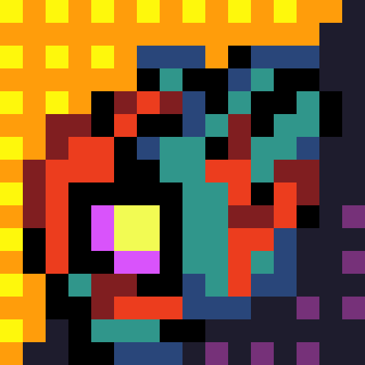

 

  

  <h3 align="center">ULTRACRAFT: Infinite Mining</h3>

  

    Minecraft mod inspired by Hakita's Ultrakill
     
     
  

   

## About The Mod

This mod lacks good scripts, so if you're willing to improve the mod contact me in my discord TheDimaX#9774

The mod works mainly in visual terms, but in terms of mechanics its poor

Still funny

<a href="optifine.net">Optifine</a> is also recommended for glowing textures

## Ultracraft Pages / Download Links

<a href="https://www.planetminecraft.com/mod/ultracraft-infinite-mining/">Planet Minecraft</a>

<a href="https://www.curseforge.com/minecraft/mc-mods/ultracraft-infinite-mining">CurseForge</a>

